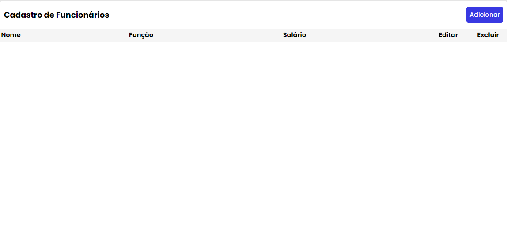
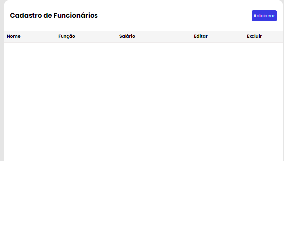
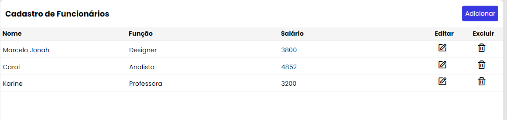
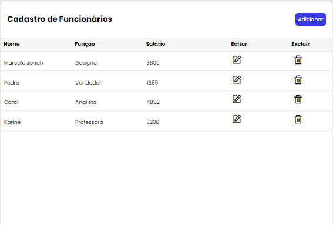
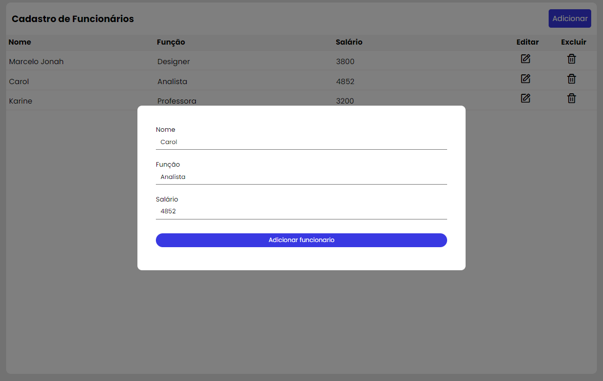
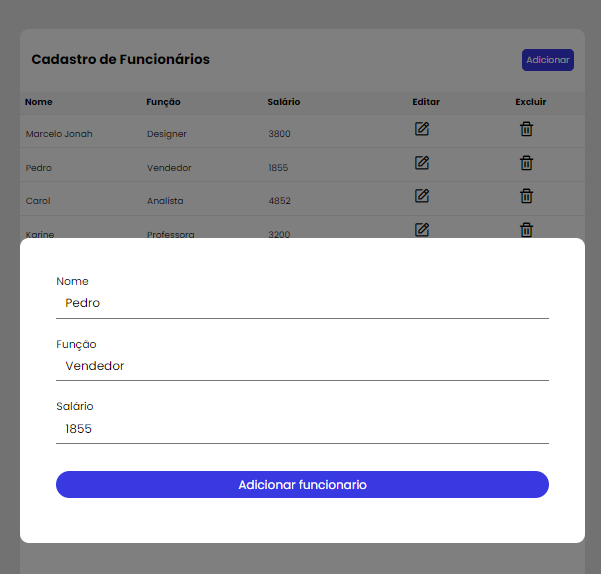
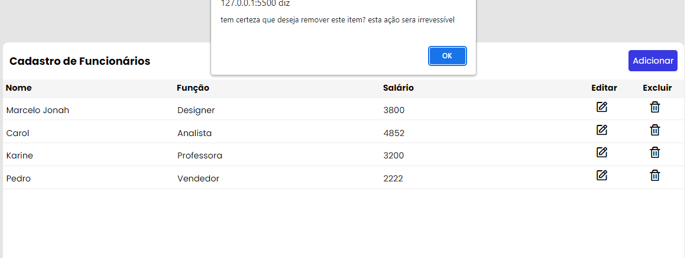
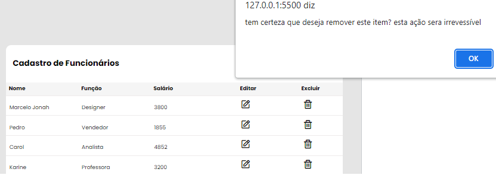
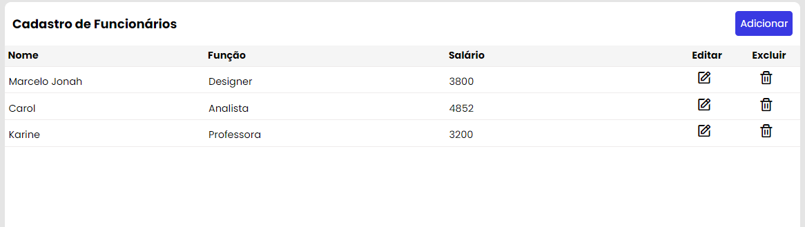

# **Cadastro de Funcionarios**

##  **Detalhes do projeto**

### Projeto responsivo desenvolvido com a funcionalidade basica de um CRUD para funcionarios de uma empresa ficticia, desenvolvido utilizando HTML E CSS para marcação e estilização e Javascript vanilla na programação
## **Project detail**

###  Responsive project developed with  basic funcionality of a CRUD to workers in a fictional employer, developed using HTML in Markup,  CSS in Stylesheet and Vanilla JavaScript as delopment language

#### Algumas imagens para mostrar o funcionamento do projeto

#### Some images to show project functionality

## Imagens mostrando a lista vazia e de forma responsiva
## Images showing an empty responsive lista

## Imagens mostrando a lista com alguns cadastros de forma responsiva

## Images showing responsive of the project with some registered person in list

## Imagens mostrando a edição e exclusão de forma responsiva

## Images showing responsivity in edition and delete function

